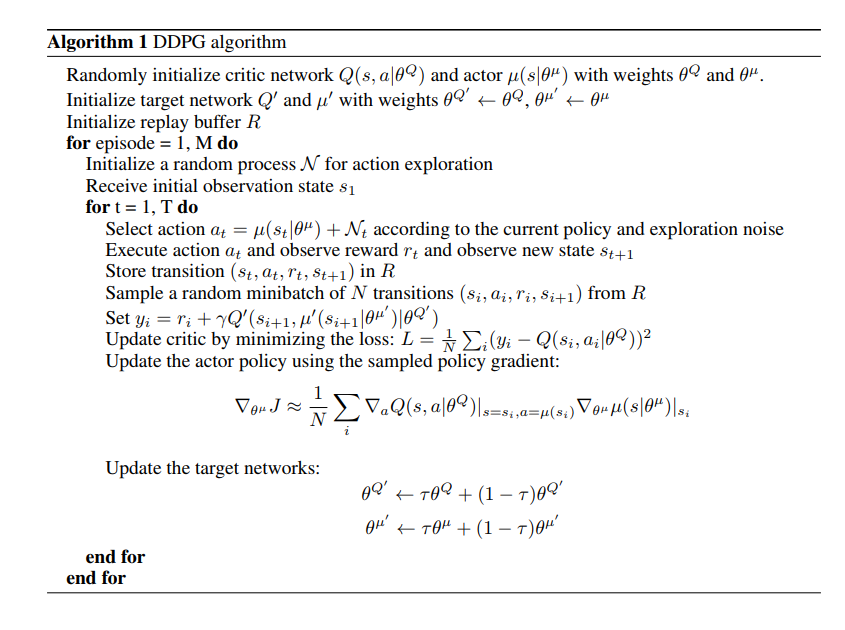
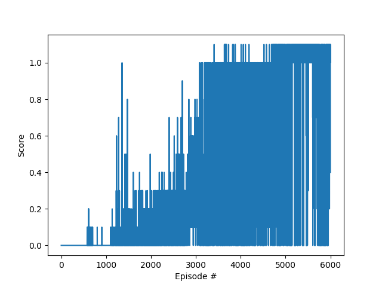

# Report
## Definitions
### State (48 = 8 * 3 * 2) and action (2,continues) space:
```
Unity brain name: TennisBrain
        Number of Visual Observations (per agent): 0
        Vector Observation space type: continuous
        Vector Observation space size (per agent): 8
        Number of stacked Vector Observation: 3
        Vector Action space type: continuous
        Vector Action space size (per agent): 2
        Vector Action descriptions: , 
```

### Solution:
The solution includes an agent trained with Deep Deterministic Policy Gradient (DDPG) approach. In order to do so, I've taken the [DDPG model and agent from my second project](https://github.com/amiravni/UDACITY_DRL_P2) and made the needed modification to transform the agent and model to this one. The changes were made using refrences from github and the [algorithm from the paper](https://arxiv.org/pdf/1509.02971.pdf)



The changes, in short are as followed:

#### Changes from project2 agent to project3 agent

* Init:
	* Number of agents is 2
	* Noise = 0.1
	* Batch Size = 256
* Step:
	* Updated replay buffer for 2 agents
	* Tried: learning procedure is executed several times every step (was back to single learning phase at the end)

#### Changes on main file
* The score function is calculated as followed: 'score += np.amax(reward)' 
* Peripherials changes to run the tennis simulation (and change from jupyter-notebook to py file)


### Agent:

```
BUFFER_SIZE = int(1e6)  # replay buffer size
BATCH_SIZE = 256         # minibatch size
GAMMA = 0.99            # discount factor
TAU = 1e-3              # for soft update of target parameters
UPDATE_EVERY = 1        # how often to update the network

NOISE_SIGMA = 0.1	# Noise sigma
LR_ACTOR = 1e-4		# **INITIAL** learning rate
LR_CRITIC = 1e-3	# **INITIAL** learning rate

```

### Network (ACTOR):
```
    def forward(self, state):
        """Build a network that maps state -> action values."""
        x = F.relu(self.fc1(state))
        x = F.dropout(x,p=0.1)
        x = F.relu(self.fc2(x))
        x = F.dropout(x,p=0.1)
        x = F.relu(self.fc3(x))
        return F.tanh(self.fc4(x))   ## added tanh
```

* fc1: Linear with 33 inputs to 100 outputs
* fc2: Linear with 100 inputs to 100 outputs
* fc3: Linear with 100 inputs to 50 outputs
* fc4: Linear with 50 inputs to 4 outputs
* Dropout with probability of 0.1 after fc1 and fc2

### Network (CRITIC):
```
    def forward(self, state,action):
        """Build a network that maps state and action -> one value"""
        x = torch.cat((state, action), dim=1)
        x = F.relu(self.fc1(x))
        x = F.dropout(x,p=0.1)
        x = F.relu(self.fc2(x))
        x = F.dropout(x,p=0.1)
        x = F.relu(self.fc3(x))
        return self.fc4(x)
```

* fc1: Linear with 37 inputs to 100 outputs
* fc2: Linear with 100 inputs to 100 outputs
* fc3: Linear with 100 inputs to 50 outputs
* fc4: Linear with 50 inputs to 1 outputs
* Dropout with probability of 0.1 after fc1 and fc2


## Learning phase:
```
n_episodes=6000
max_t=200
#actor_scheduler = torch.optim.lr_scheduler.StepLR(agents.actor_optimizer, step_size=75, gamma=0.1)
#critic_scheduler = torch.optim.lr_scheduler.StepLR(agents.critic_optimizer, step_size=75, gamma=0.1)
```

* Last project, I tried to play with the learning rate, but couldn't achieve better results. This time I chose the LR to be constant and will play it in future attemps.

### Netowrk:
The network final architecture was as described in the definitions. 

### Agent:
DDPG was implemented as described.

### Learning Phase:

* The phase consist of 6000 episodes finally. Initially I begun with 2000 episodes, which wasn't enough.
* I started with 'max_t = 1000' and got to [a very high average score](./Results/BS_256_EP_6000_TMAX_1000_NOISE_0.01/log.txt) but at the same time the learning became very slow  (Since the games took longer) and these scores where far more than needed. So I reduced max_t to 200, achieving approximally average score of ~1.03. 
* At some point, after 5600 episodes, the score begun to decrease. All data can be found under the folder [BS_256_EP_6000_TMAX_200_NOISE_0.1](./Results/BS_256_EP_6000_TMAX_200_NOISE_0.1/).
* This phase with the selected parameters yield [the next output](./Results/BS_256_EP_6000_TMAX_200_NOISE_0.1/log.txt), and as shown in the graph:



```
Episode 5600	Average Score (100): 1.03
Saving...
```

### Test Phase:
At this phase the network only evaluate the predicted action at a given state.
For this phase network with the weights after 5600 episodes were used. (After 3700 episodes the score was already over 0.5) 
This phase yields and average score of ~0.93 - **Meaning the agents were able to receive an average reward (over 100 episodes) of at least +0.5**. 


```
Final Score: ==> 0.93000001385808
```


### Another "Not Bad" attemp

* [BS_256_EP_6000_TMAX_200_NOISE_0.1_LR_5_TAU_3e3](./Results/BS_256_EP_6000_TMAX_200_NOISE_0.1_LR_5_TAU_3e3/)
* Larger LR (5 times larger to both actor and critic)
* Larger Tau (3 times larger)
* Seems the convergence was faster but got only to ~0.85 and with lower values on the test as well. The lower values might be due to higher variance of the results.


```
Episode 3100	Average Score (100): 0.85
Saving...
```


```
Final Score: ==> 0.6780000101029873
```

## Ideas for future work

* Testing the dynamic learning rate approach.
* Testing multy agents approachs.
* Testing more complex network architecture
* Make more hyperparameter testing, in particular changing some parameters (GAMMA, TAU) to dynamic parameters
